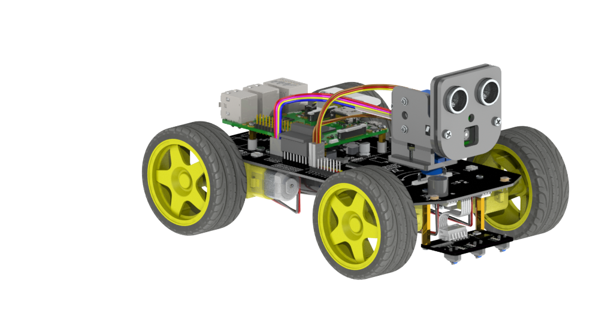

# freenove_4wd_ros

ROS driver for controlling [Freenove 4WD Smart Car Kit for Raspberry Pi](https://github.com/Freenove/Freenove_4WD_Smart_Car_Kit_for_Raspberry_Pi/tree/master?tab=readme-ov-file#freenove-4wd-smart-car-kit-for-raspberry-pi) via [ROS](https://www.ros.org/).



With this driver, the car can be controlled by publishing a `geometry_msgs/msg/Twist` message to the `/cmd_vel` topic.

The driver also includes an example launch file for control via an xbox gamepad [`gamepad_teleop.launch.py`](freenove_4wd_ros/launch/gamepad_teleop.launch.py).

In this first iteration, only this basic control interface is implemented. Future work could look at supporting other sensors, odometry etc, but I'm not planning to look at that.

Tested on ROS2 Jazzy, Ubuntu 24.04, Raspberry Pi 4B.

Gamepad control tested with Logitech gamepad F310.

## Setup

Clone/build in a colcon workspace:

```bash
mkdir -p colcon_ws/src && cd colcon_ws/src
git clone git@github.com:tim-fan/freenove_4wd_ros.git
cd ..
rosdep install --from-paths src --ignore-src
colcon build
source install/setup.bash
```

## Calibrate, Configure, Test

[drive_config.yaml](./config/drive_config.yaml) contains parameters related to motor channel configuration, and motor velocity scaling. The default parameters work on my platform, but may require tuning for your platform.

To determine the appropriate value for `max_speed`, you can run 

```bash
ros2 run freenove_4wd_ros test_full_speed_straight
```

Try to estimate the robot speed (metres per second), and update the yaml with the corresponding value.

To help determine the correct channel configuration:

```bash
ros2 run freenove_4wd_ros test_motors
```

Note that script uses the channel configuration defined in [`freenove4wd/__init__.py`](freenove_4wd_ros/freenove4wd/__init__.py), not the config from the yaml file.


## Run

To launch the driver by itself:

```bash
ros2 launch freenove_4wd_ros driver.launch.py
```

To run with gamepad controller, first plug controller to RPi USB, then:

```bash
ros2 launch freenove_4wd_ros gamepad_teleop.launch.py
```


